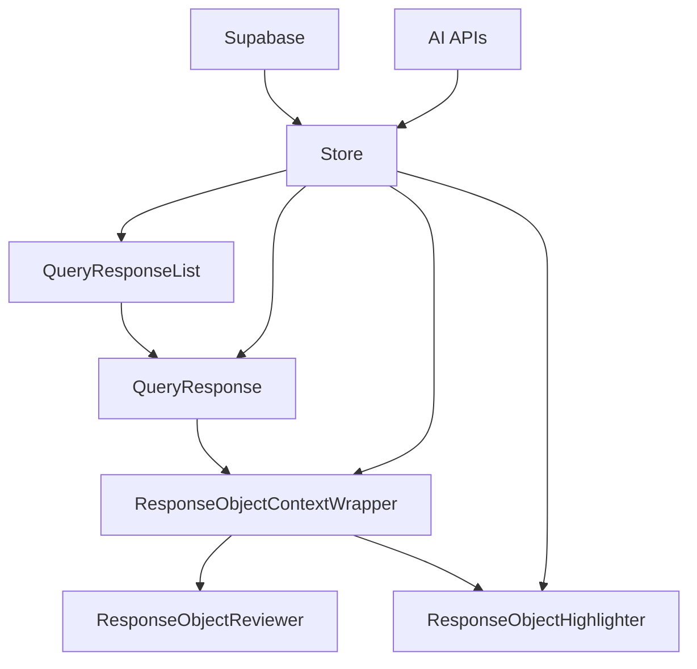
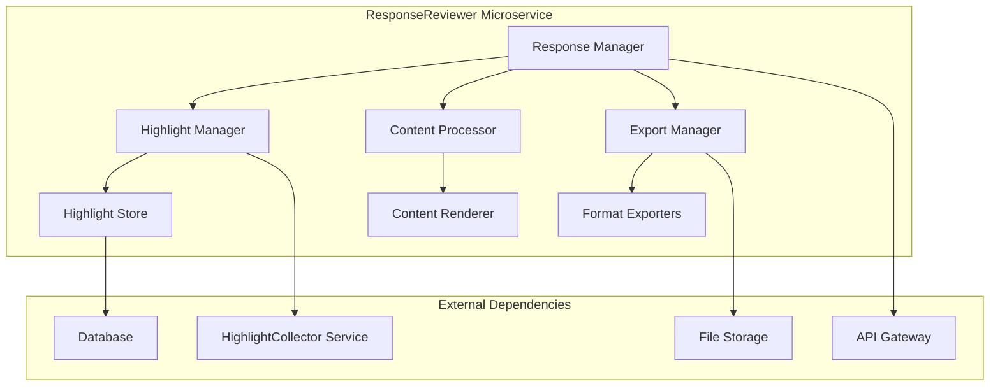
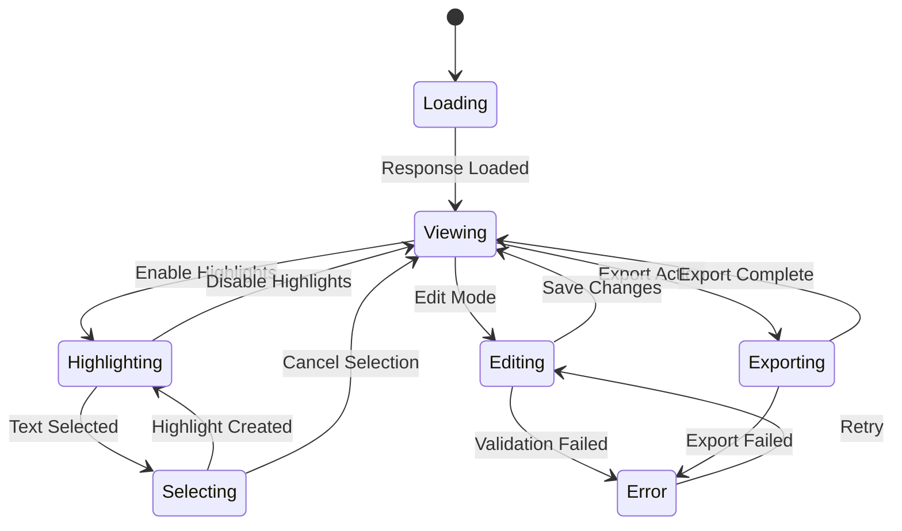

# ResponseReviewer Module Analysis and Specification

## Current Architecture Analysis

### Component Hierarchy and Data Flow



### Core Components Analysis

#### 1. QueryResponseList Component (`src/components/QueryResponseList.tsx:5-40`)

**Functionality:**
- Renders a scrollable list of AI responses
- Displays empty state when no responses exist
- Maps through `queryResponses` from global store
- Links responses to their template sections

**Key Functions:**
```typescript
// Main render logic
const { queryResponses, selectedTemplate } = useStore();
queryResponses.map((response) => {
  const section = selectedTemplate?.sections.find(
    s => s.id === response.promptSectionId
  );
  return (
    <QueryResponse
      key={response.id}
      response={response}
      sectionTitle={section?.title}
    />
  );
})
```

#### 2. QueryResponse Component (`src/components/QueryResponse.tsx:12-57`)

**Functionality:**
- Individual response container with edit capabilities
- Handles error state editing via RequestEditor
- Manages editing state locally

**Key Functions:**
```typescript
// Template update handler
const handleSaveTemplate = async (content: string, isJavaScript: boolean) => {
  await updateRequestTemplate(response.modelId, content, isJavaScript);
  setIsEditing(false);
};

// Edit trigger (only for error responses)
{response.status === 'error' && (
  <button onClick={() => setIsEditing(true)}>
    <Edit className="h-4 w-4" />
  </button>
)}
```

#### 3. ResponseObjectContextWrapper Component (`src/components/ResponseObjectContextWrapper.tsx:14-127`)

**Functionality:**
- Primary response display container with metadata
- Handles highlighting mode toggle
- Manages highlight state locally
- Provides section navigation

**Key Functions:**
```typescript
// Highlight mode toggle
const [isHighlighted, setIsHighlighted] = React.useState(false);
const [highlights, setHighlights] = React.useState<Array<{ 
  start: number; end: number; color: string 
}>>([]);

// Section navigation
const handleSectionClick = () => {
  if (section) {
    const sectionElement = document.getElementById(`section-${section.id}`);
    if (sectionElement) {
      sectionElement.scrollIntoView({ behavior: 'smooth' });
    }
  }
};
```

#### 4. ResponseObjectReviewer Component (`src/components/ResponseObjectReviewer.tsx:15-132`)

**Functionality:**
- CodeMirror-based content viewer
- Automatic JSON/Markdown detection and formatting
- Read-only display with syntax highlighting
- Loading states for pending responses

**Key Functions:**
```typescript
// Content type detection and formatting
let formattedContent = content;
let isJson = false;

try {
  JSON.parse(content);
  isJson = true;
  formattedContent = JSON.stringify(JSON.parse(content), null, 2);
} catch {
  console.info('Content appears to be Markdown');
}

// Editor configuration
const view = new EditorView({
  doc: formattedContent,
  extensions: [
    basicSetup,
    isJson ? [json(), lintGutter(), linter(jsonParseLinter())] : [markdown()],
    oneDark,
    EditorView.editable.of(false)
  ]
});
```

#### 5. ResponseObjectHighlighter Component (`src/components/ResponseObjectHighlighter.tsx:26-244`)

**Functionality:**
- Text selection and highlighting interface
- Multi-color highlighting system
- Persistent highlight storage to Supabase
- Integration with record selection

**Key Functions:**
```typescript
// Highlight creation and persistence
const handleHighlight = async () => {
  const newHighlight = {
    start: selection.start,
    end: selection.end,
    color: selectedColor
  };

  const highlightData = {
    id: crypto.randomUUID(),
    response_id: responseId,
    content: content,
    highlights: newHighlights,
    section_id: sectionId,
    section_title: sectionTitle,
    model_id: modelId,
    created_at: new Date().toISOString(),
    record_id: selectedRecord.id,
    record_name: selectedRecord.name
  };

  await addHighlight(highlightData);
};
```

### Data Model Analysis

#### QueryResponse Interface (`src/types/index.ts:2-13`)
```typescript
export interface QueryResponse {
  id: string;
  promptSectionId: string;
  modelId: string;
  content: string;
  timestamp: string;
  status: 'connecting' | 'pending' | 'completed' | 'error';
  error?: string;
  requestTemplate?: string;
  isJavaScript?: boolean;
  sectionTitle?: string;
}
```

#### Highlight Interface (`src/store/index.ts:8-19`)
```typescript
interface Highlight {
  id: string;
  response_id: string;
  content: string;
  highlights: Array<{ start: number; end: number; color: string }>;
  section_title?: string;
  section_id?: string;
  model_id: string;
  created_at: string;
  record_id: string;
  record_name: string;
}
```

## ResponseReviewer Microservice Specification

### Service Architecture



### Core Functionality Requirements

#### 1. Response Collection and Management
```typescript
interface ResponseManager {
  // CRUD operations for API responses
  createResponse(response: APIResponse): Promise<string>;
  getResponse(id: string): Promise<APIResponse>;
  updateResponse(id: string, updates: Partial<APIResponse>): Promise<void>;
  deleteResponse(id: string): Promise<void>;
  
  // List and filter responses
  listResponses(filters: ResponseFilters): Promise<APIResponse[]>;
  searchResponses(query: string): Promise<APIResponse[]>;
}

interface APIResponse {
  id: string;
  promptSectionId: string;
  modelId: string;
  content: string;
  timestamp: string;
  status: ResponseStatus;
  error?: string;
  metadata: ResponseMetadata;
}
```

#### 2. Content Processing and Rendering
```typescript
interface ContentProcessor {
  // Format detection and processing
  detectContentType(content: string): ContentType;
  formatContent(content: string, type: ContentType): FormattedContent;
  
  // Syntax highlighting and validation
  validateJSON(content: string): ValidationResult;
  highlightSyntax(content: string, language: string): HighlightedContent;
}

enum ContentType {
  JSON = 'json',
  MARKDOWN = 'markdown',
  PLAINTEXT = 'plaintext',
  XML = 'xml',
  HTML = 'html'
}
```

#### 3. Highlight Management System
```typescript
interface HighlightManager {
  // Highlight CRUD operations
  createHighlight(highlight: HighlightData): Promise<string>;
  getHighlights(responseId: string): Promise<HighlightData[]>;
  updateHighlight(id: string, updates: Partial<HighlightData>): Promise<void>;
  deleteHighlight(id: string): Promise<void>;
  
  // Batch operations
  deleteHighlightGroup(responseId: string, groupId: string): Promise<void>;
  exportHighlights(responseId: string): Promise<HighlightExport>;
  
  // Integration with HighlightCollector
  sendToCollector(highlights: HighlightData[]): Promise<void>;
}

interface HighlightData {
  id: string;
  responseId: string;
  startPosition: number;
  endPosition: number;
  color: string;
  selectedText: string;
  context: HighlightContext;
  timestamp: string;
}
```

#### 4. Export and Save Operations
```typescript
interface ExportManager {
  // Export formats
  exportToJSON(responseId: string): Promise<Blob>;
  exportToMarkdown(responseId: string): Promise<Blob>;
  exportToPDF(responseId: string): Promise<Blob>;
  exportHighlightsOnly(responseId: string): Promise<Blob>;
  
  // Save operations
  saveResponse(responseId: string, location: SaveLocation): Promise<void>;
  saveHighlights(responseId: string, location: SaveLocation): Promise<void>;
}
```

### State Management Pattern



### API Endpoints Design

```typescript
// RESTful API design
interface ResponseReviewerAPI {
  // Response management
  'GET /responses': (filters: ResponseFilters) => APIResponse[];
  'POST /responses': (response: CreateResponseRequest) => APIResponse;
  'GET /responses/:id': (id: string) => APIResponse;
  'PUT /responses/:id': (id: string, updates: UpdateResponseRequest) => APIResponse;
  'DELETE /responses/:id': (id: string) => void;
  
  // Highlight management
  'GET /responses/:id/highlights': (id: string) => HighlightData[];
  'POST /responses/:id/highlights': (id: string, highlight: CreateHighlightRequest) => HighlightData;
  'DELETE /responses/:id/highlights/:highlightId': (responseId: string, highlightId: string) => void;
  
  // Export operations
  'GET /responses/:id/export': (id: string, format: ExportFormat) => Blob;
  'POST /responses/:id/save': (id: string, location: SaveLocation) => SaveResult;
  
  // Integration endpoints
  'POST /responses/:id/send-highlights': (id: string, collectorEndpoint: string) => void;
}
```

### Integration with HighlightCollector

The highlighting functionality is **present** in the current components. The `ResponseObjectHighlighter` component handles:

1. **Text Selection**: Users can select text within responses
2. **Multi-color Highlighting**: 5 color options for categorization
3. **Persistent Storage**: Highlights saved to Supabase database
4. **Contextual Information**: Links highlights to records and sections

The integration with HighlightCollector would involve:

```typescript
// Send highlights to collector service
const sendHighlightsToCollector = async (responseId: string) => {
  const highlights = await getHighlights(responseId);
  const collectorPayload = {
    source: 'response-reviewer',
    responseId,
    highlights: highlights.map(h => ({
      text: h.selectedText,
      context: h.context,
      metadata: {
        modelId: h.modelId,
        sectionTitle: h.sectionTitle,
        timestamp: h.timestamp
      }
    }))
  };
  
  await fetch('/api/highlight-collector/collect', {
    method: 'POST',
    body: JSON.stringify(collectorPayload)
  });
};
```

### Migration Strategy

1. **Phase 1**: Extract current response display logic into standalone service
2. **Phase 2**: Implement microservice APIs and database layer
3. **Phase 3**: Add export and advanced management features
4. **Phase 4**: Integrate with HighlightCollector service
5. **Phase 5**: Deploy as independent microservice with microfrontend

This analysis provides a complete specification for migrating the current monolithic response management into a dedicated ResponseReviewer microservice while preserving all existing functionality and adding enhanced capabilities for response evaluation, editing, saving, and highlighting.