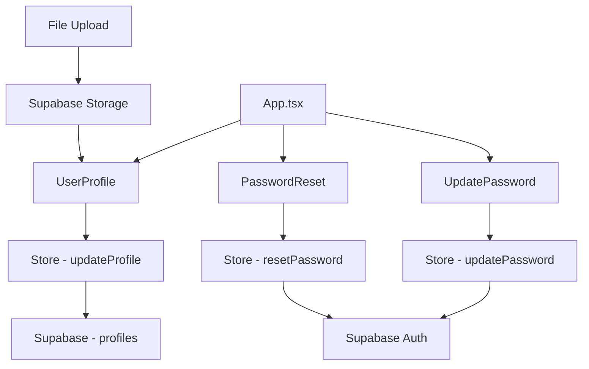
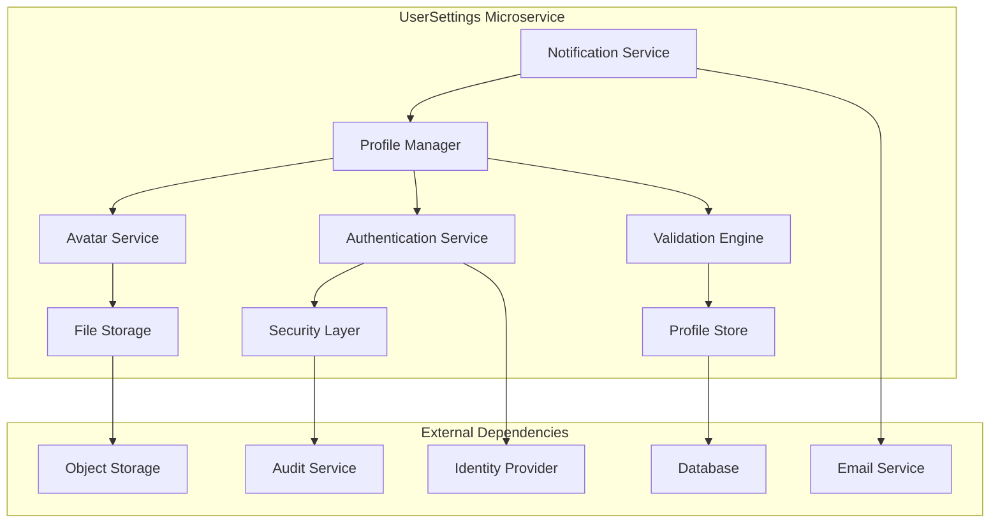
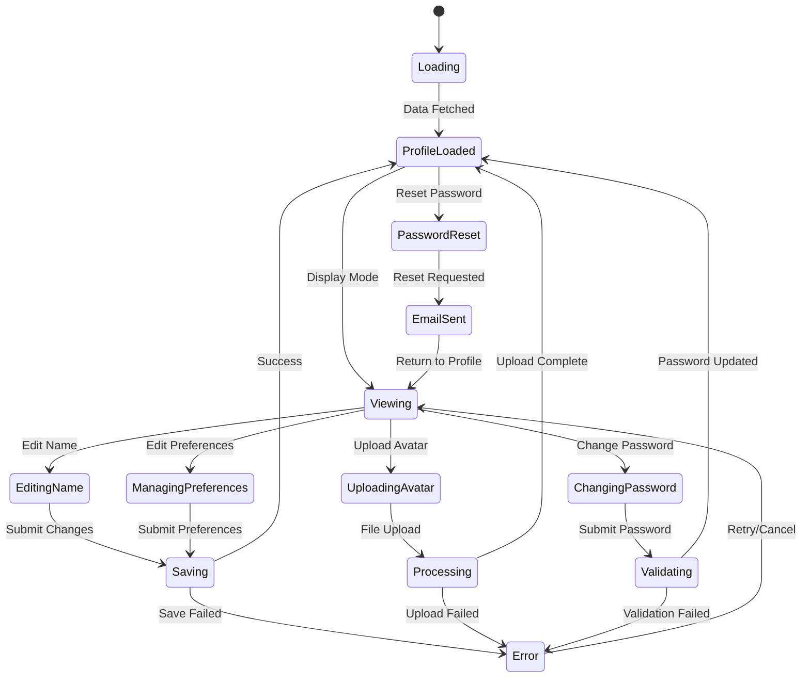

# UserSettings Module Analysis and Specification

## Current Architecture Analysis

### Component Hierarchy and Data Flow



### Purpose and Business Logic

The UserSettings system manages user account information and authentication flows:

1. **Profile Management**: Display name and avatar customization
2. **Password Management**: Secure password updates and reset flows
3. **Avatar Management**: Custom image uploads with Supabase Storage integration
4. **Authentication Flow**: Integrated with Supabase Auth for secure operations
5. **Route-based Context**: Password reset handles URL-based authentication state

### Core Components Analysis

#### 1. UserProfile Component (`src/components/UserProfile.tsx:6-139`)

**Functionality:**
- Compact profile display and editing interface
- Avatar upload with file management
- Display name editing with inline save/cancel
- Integration with Supabase Storage for avatar hosting
- Fallback handling for missing avatars

**Key Functions:**
```typescript
// Avatar URL resolution with custom/OAuth fallback
const avatarUrl = profile?.custom_avatar_path
  ? `${import.meta.env.VITE_SUPABASE_URL}/storage/v1/object/public/avatars/${profile.custom_avatar_path}`
  : profile?.avatar_url;

// File upload with unique path generation
const handleFileChange = async (event: React.ChangeEvent<HTMLInputElement>) => {
  const file = event.target.files?.[0];
  if (!file || !user) return;

  try {
    setIsUploading(true);
    
    // Generate unique file path
    const fileExt = file.name.split('.').pop();
    const filePath = `${user.id}/${crypto.randomUUID()}.${fileExt}`;
    
    // Upload to Supabase Storage
    const { error: uploadError } = await supabase.storage
      .from('avatars')
      .upload(filePath, file);

    if (uploadError) throw uploadError;

    // Update profile with new avatar path
    await updateProfile({
      ...profile,
      custom_avatar_path: filePath,
      avatar_url: null // Clear OAuth avatar URL
    });
  } catch (error) {
    console.error('Error uploading avatar:', error);
    alert('Failed to upload avatar. Please try again.');
  } finally {
    setIsUploading(false);
  }
};

// Display name update
const handleSave = async () => {
  if (!profile) return;
  
  try {
    await updateProfile({
      ...profile,
      display_name: displayName.trim()
    });
    setIsEditing(false);
  } catch (error) {
    console.error('Error updating profile:', error);
    alert('Failed to update profile. Please try again.');
  }
};
```

**State Management:**
- `isEditing`: Toggle between view and edit modes
- `displayName`: Local state for name editing
- `isUploading`: Loading state for file uploads
- `fileInputRef`: Reference for hidden file input

**Visual Design:**
- Horizontal layout with avatar and name
- Overlay camera button for avatar uploads
- Inline editing with save/cancel buttons
- Loading states and disabled inputs during operations

#### 2. UpdatePassword Component (`src/components/UpdatePassword.tsx:4-83`)

**Functionality:**
- Password update form with confirmation
- Client-side password matching validation
- Success state with URL hash cleanup
- Error handling and display

**Key Functions:**
```typescript
// Form submission with validation
const handleSubmit = async (e: React.FormEvent) => {
  e.preventDefault();
  setError('');

  // Client-side validation
  if (password !== confirmPassword) {
    setError('Passwords do not match');
    return;
  }

  try {
    await updatePassword(password);
    setIsSuccess(true);
    // Remove the hash from the URL (from password reset flow)
    window.location.hash = '';
  } catch (err) {
    setError(err instanceof Error ? err.message : 'An error occurred');
  }
};
```

**State Management:**
- `password`: New password input
- `confirmPassword`: Confirmation input
- `error`: Error message display
- `isSuccess`: Success state toggle

**Flow Integration:**
- Used in App.tsx when `isPasswordUpdate` route is detected
- Handles URL hash cleanup after successful update
- Provides success confirmation before returning to sign-in

#### 3. PasswordReset Component (`src/components/PasswordReset.tsx:9-87`)

**Functionality:**
- Email-based password reset initiation
- Two-state flow: request form and confirmation
- Navigation back to sign-in flow
- Visual feedback with icons and messaging

**Key Functions:**
```typescript
// Reset request submission
const handleSubmit = async (e: React.FormEvent) => {
  e.preventDefault();
  setError('');
  
  try {
    await resetPassword(email);
    setIsSubmitted(true);
  } catch (err) {
    setError(err instanceof Error ? err.message : 'An error occurred');
  }
};
```

**State Management:**
- `email`: Email input for reset
- `isSubmitted`: Toggle between form and confirmation
- `error`: Error message display

**User Experience:**
- Clear visual progression from form to confirmation
- Email address confirmation in success message
- Consistent back navigation to sign-in

### Data Model Analysis

#### Profile Interface (`src/types/database.ts:4-29`)
```typescript
interface ProfileRow {
  id: string;                          // User ID (matches auth.users.id)
  display_name: string | null;         // User's chosen display name
  avatar_url: string | null;           // OAuth provider avatar URL
  custom_avatar_path: string | null;   // Supabase Storage path for custom avatar
  provider_data: any;                  // Additional OAuth provider data
  updated_at: string;                  // Last update timestamp
}

interface ProfileInsert {
  id: string;                          // Required: User ID
  display_name?: string | null;        // Optional: Display name
  avatar_url?: string | null;          // Optional: OAuth avatar
  custom_avatar_path?: string | null;  // Optional: Custom avatar path
  provider_data?: any;                 // Optional: Provider data
  updated_at?: string;                 // Optional: Update timestamp
}

interface ProfileUpdate {
  id?: string;                         // Optional: User ID
  display_name?: string | null;        // Optional: Display name update
  avatar_url?: string | null;          // Optional: Avatar URL update
  custom_avatar_path?: string | null;  // Optional: Custom avatar update
  provider_data?: any;                 // Optional: Provider data update
  updated_at?: string;                 // Optional: Timestamp update
}
```

### Store Operations Analysis (`src/store/index.ts:116-136`)

#### Authentication Operations:
```typescript
// Password reset via email
resetPassword: async (email) => {
  try {
    const { error } = await supabase.auth.resetPasswordForEmail(email);
    if (error) throw error;
  } catch (error) {
    console.error('Error resetting password:', error);
    throw error;
  }
};

// Password update (for authenticated users)
updatePassword: async (password) => {
  try {
    const { error } = await supabase.auth.updateUser({
      password
    });
    if (error) throw error;
  } catch (error) {
    console.error('Error updating password:', error);
    throw error;
  }
};
```

**Note**: The `updateProfile` function referenced in UserProfile.tsx is not found in the current store implementation, suggesting either:
1. It's missing from the current codebase
2. It's implemented elsewhere
3. It needs to be added to complete the profile management functionality

## UserSettings Microservice Specification

### Service Architecture



### Core Functionality Requirements

#### 1. Profile Management System
```typescript
interface ProfileManager {
  // Profile CRUD operations
  getProfile(userId: string): Promise<UserProfile>;
  updateProfile(userId: string, updates: ProfileUpdateRequest): Promise<UserProfile>;
  deleteProfile(userId: string): Promise<void>;
  
  // Avatar management
  uploadAvatar(userId: string, file: File): Promise<AvatarUploadResult>;
  deleteAvatar(userId: string): Promise<void>;
  getAvatarUrl(userId: string): Promise<string | null>;
  
  // Profile validation
  validateProfileData(data: ProfileUpdateRequest): Promise<ValidationResult>;
  sanitizeDisplayName(name: string): string;
  
  // Profile analytics
  getProfileCompleteness(userId: string): Promise<ProfileCompleteness>;
  getProfileActivity(userId: string): Promise<ProfileActivity>;
}

interface UserProfile {
  id: string;
  displayName: string | null;
  email: string;
  avatarUrl: string | null;
  customAvatarPath: string | null;
  providerData: Record<string, any>;
  preferences: UserPreferences;
  security: SecuritySettings;
  createdAt: string;
  updatedAt: string;
  lastLoginAt: string;
}

interface ProfileUpdateRequest {
  displayName?: string;
  preferences?: Partial<UserPreferences>;
  customFields?: Record<string, any>;
}

interface UserPreferences {
  theme: 'light' | 'dark' | 'system';
  language: string;
  timezone: string;
  notifications: NotificationPreferences;
  privacy: PrivacySettings;
}
```

#### 2. Avatar Management System
```typescript
interface AvatarService {
  // File operations
  uploadAvatar(userId: string, file: File, options?: UploadOptions): Promise<AvatarUploadResult>;
  deleteAvatar(userId: string): Promise<void>;
  resizeAvatar(userId: string, dimensions: ImageDimensions): Promise<string>;
  
  // URL management
  generateAvatarUrl(path: string): string;
  generateSignedUrl(path: string, expiresIn?: number): Promise<string>;
  
  // Validation
  validateFile(file: File): Promise<FileValidationResult>;
  scanForMalware(file: File): Promise<SecurityScanResult>;
  
  // Optimization
  optimizeImage(file: File): Promise<File>;
  generateThumbnails(userId: string, sizes: number[]): Promise<ThumbnailSet>;
}

interface UploadOptions {
  maxFileSize: number;
  allowedFormats: string[];
  generateThumbnails: boolean;
  overwriteExisting: boolean;
}

interface AvatarUploadResult {
  path: string;
  url: string;
  thumbnails?: Record<string, string>;
  metadata: FileMetadata;
}

interface FileMetadata {
  originalName: string;
  size: number;
  format: string;
  dimensions: ImageDimensions;
  uploadedAt: string;
}
```

#### 3. Authentication and Security System
```typescript
interface AuthenticationService {
  // Password management
  updatePassword(userId: string, currentPassword: string, newPassword: string): Promise<void>;
  resetPassword(email: string): Promise<PasswordResetResult>;
  confirmPasswordReset(token: string, newPassword: string): Promise<void>;
  
  // Account security
  enableTwoFactor(userId: string): Promise<TwoFactorSetup>;
  disableTwoFactor(userId: string, verificationCode: string): Promise<void>;
  generateRecoveryCodes(userId: string): Promise<string[]>;
  
  // Session management
  invalidateAllSessions(userId: string): Promise<void>;
  getActiveSessions(userId: string): Promise<UserSession[]>;
  revokeSession(userId: string, sessionId: string): Promise<void>;
  
  // Security monitoring
  getSecurityEvents(userId: string): Promise<SecurityEvent[]>;
  reportSuspiciousActivity(userId: string, event: SecurityEvent): Promise<void>;
}

interface PasswordResetResult {
  resetToken: string;
  expiresAt: string;
  emailSent: boolean;
}

interface TwoFactorSetup {
  secret: string;   // Base32 encoded secret
  qrCode: string;   // QR code for authenticator apps
  backupCodes: string[];
}

interface SecurityEvent {
  id: string;
  userId: string;
  type: SecurityEventType;
  description: string;
  ipAddress: string;
  userAgent: string;
  location?: GeolocationData;
  timestamp: string;
  riskLevel: 'low' | 'medium' | 'high';
}

enum SecurityEventType {
  LOGIN = 'login',
  LOGOUT = 'logout',
  PASSWORD_CHANGE = 'password_change',
  PROFILE_UPDATE = 'profile_update',
  AVATAR_UPLOAD = 'avatar_upload',
  SUSPICIOUS_ACTIVITY = 'suspicious_activity'
}
```

#### 4. Preferences and Settings System
```typescript
interface PreferencesManager {
  // User preferences
  getPreferences(userId: string): Promise<UserPreferences>;
  updatePreferences(userId: string, updates: Partial<UserPreferences>): Promise<UserPreferences>;
  resetPreferences(userId: string): Promise<UserPreferences>;
  
  // Notification settings
  updateNotificationPreferences(userId: string, preferences: NotificationPreferences): Promise<void>;
  getNotificationHistory(userId: string): Promise<NotificationEvent[]>;
  
  // Privacy settings
  updatePrivacySettings(userId: string, settings: PrivacySettings): Promise<void>;
  exportUserData(userId: string): Promise<UserDataExport>;
  requestDataDeletion(userId: string): Promise<DeletionRequest>;
  
  // Theme and UI
  setTheme(userId: string, theme: ThemePreference): Promise<void>;
  getThemePreference(userId: string): Promise<ThemePreference>;
}

interface NotificationPreferences {
  email: EmailNotificationSettings;
  push: PushNotificationSettings;
  inApp: InAppNotificationSettings;
  frequency: NotificationFrequency;
}

interface PrivacySettings {
  profileVisibility: 'public' | 'private' | 'friends';
  dataSharing: boolean;
  analyticsOptOut: boolean;
  marketingOptOut: boolean;
  locationTracking: boolean;
}

enum NotificationFrequency {
  IMMEDIATE = 'immediate',
  HOURLY = 'hourly',
  DAILY = 'daily',
  WEEKLY = 'weekly',
  NEVER = 'never'
}
```

### API Endpoints Design

```typescript
interface UserSettingsAPI {
  // Profile management
  'GET /users/:userId/profile': (userId: string) => UserProfile;
  'PUT /users/:userId/profile': (userId: string, updates: ProfileUpdateRequest) => UserProfile;
  'DELETE /users/:userId/profile': (userId: string) => void;
  
  // Avatar management
  'POST /users/:userId/avatar': (userId: string, file: FormData) => AvatarUploadResult;
  'DELETE /users/:userId/avatar': (userId: string) => void;
  'GET /users/:userId/avatar': (userId: string, size?: string) => AvatarResponse;
  
  // Password management
  'PUT /users/:userId/password': (userId: string, passwordChange: PasswordChangeRequest) => void;
  'POST /auth/password-reset': (email: string) => PasswordResetResult;
  'POST /auth/password-reset/confirm': (token: string, password: string) => void;
  
  // Preferences
  'GET /users/:userId/preferences': (userId: string) => UserPreferences;
  'PUT /users/:userId/preferences': (userId: string, preferences: Partial<UserPreferences>) => UserPreferences;
  
  // Security
  'GET /users/:userId/security': (userId: string) => SecuritySettings;
  'POST /users/:userId/security/2fa/enable': (userId: string) => TwoFactorSetup;
  'POST /users/:userId/security/2fa/disable': (userId: string, code: string) => void;
  'GET /users/:userId/security/sessions': (userId: string) => UserSession[];
  'DELETE /users/:userId/security/sessions/:sessionId': (userId: string, sessionId: string) => void;
  
  // Data management
  'GET /users/:userId/data-export': (userId: string) => UserDataExport;
  'POST /users/:userId/data-deletion': (userId: string) => DeletionRequest;
  'GET /users/:userId/activity': (userId: string, filters?: ActivityFilters) => UserActivity[];
}
```

### State Management Pattern



### Integration Patterns

#### 1. Component Integration
```typescript
// React Hook Pattern
interface useUserSettings {
  (userId: string): {
    profile: UserProfile | null;
    isLoading: boolean;
    updateProfile: (updates: ProfileUpdateRequest) => Promise<void>;
    uploadAvatar: (file: File) => Promise<void>;
    updatePassword: (currentPassword: string, newPassword: string) => Promise<void>;
    resetPassword: (email: string) => Promise<void>;
    preferences: UserPreferences;
    updatePreferences: (updates: Partial<UserPreferences>) => Promise<void>;
  }
}

// Event System
interface UserSettingsEvents {
  'profile.updated': (event: ProfileUpdatedEvent) => void;
  'avatar.uploaded': (event: AvatarUploadedEvent) => void;
  'password.changed': (event: PasswordChangedEvent) => void;
  'preferences.updated': (event: PreferencesUpdatedEvent) => void;
}
```

#### 2. Security Integration
```typescript
interface SecurityIntegration {
  // Audit logging
  logSecurityEvent(userId: string, event: SecurityEvent): Promise<void>;
  
  // Rate limiting
  checkRateLimit(userId: string, action: string): Promise<boolean>;
  
  // Input validation
  sanitizeInput(input: any, schema: ValidationSchema): any;
  
  // File security
  scanUploadedFile(file: File): Promise<SecurityScanResult>;
}
```

### Migration Strategy

1. **Phase 1**: Extract profile components into standalone service
2. **Phase 2**: Implement comprehensive profile and avatar management
3. **Phase 3**: Add advanced security features (2FA, session management)
4. **Phase 4**: Implement preferences and privacy controls
5. **Phase 5**: Add analytics, audit logging, and compliance features

### Advanced Features for Future Development

#### 1. Social Profile Features
```typescript
interface SocialProfileManager {
  // Profile linking
  linkSocialAccount(userId: string, provider: string, accountData: any): Promise<void>;
  unlinkSocialAccount(userId: string, provider: string): Promise<void>;
  
  // Profile synchronization
  syncProfileFromProvider(userId: string, provider: string): Promise<void>;
  
  // Social verification
  verifyProfile(userId: string, verificationMethod: string): Promise<VerificationResult>;
}
```

#### 2. Advanced Analytics
```typescript
interface ProfileAnalytics {
  // Usage analytics
  getProfileViewAnalytics(userId: string): Promise<ViewAnalytics>;
  getEngagementMetrics(userId: string): Promise<EngagementMetrics>;
  
  // Personalization
  generatePersonalizationInsights(userId: string): Promise<PersonalizationData>;
  recommendProfileImprovements(userId: string): Promise<ProfileRecommendation[]>;
}
```

This analysis provides a comprehensive specification for transforming the current user settings components into a robust, secure, and feature-rich UserSettings microservice that can handle all aspects of user profile and account management while maintaining security, privacy, and user experience best practices.