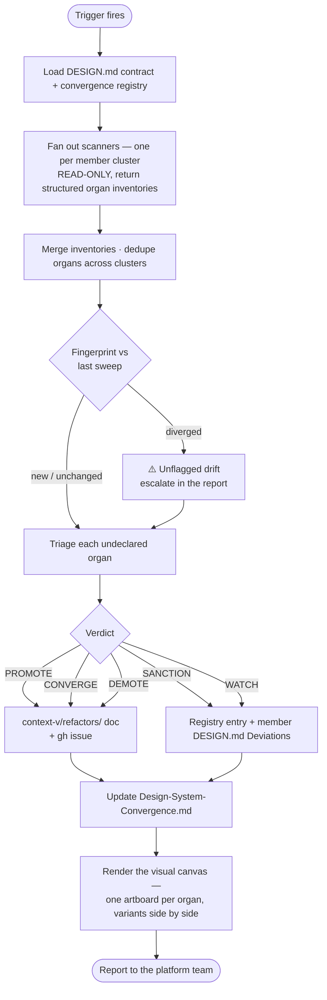

# Converge the Federated Design System

> `context-v/loops/` is **experimental**. Siblings:
> [[Sweep-Local-Federated-Design-System-for-Fidelity]] (token fidelity, per-member,
> already proven) and [[Endow-A-Component-With-Its-Own-Contracts]] (per-unit docs).
> **This loop is the component lane.** Fidelity asks "does this member use the
> federal tokens correctly." Convergence asks "did two members build the same
> thing without knowing."

## The problem this loop exists for

`augment-it` is heading toward **one repo per app or service, owned by teams of
one to three people.** That is the destination the architecture is already shaped
for — sovereign members, no shared federation runtime, independent deploys.

The failure mode of that shape is not chaos. It is **quiet redundancy**: two teams
solve the same problem in the same week, neither knows, and eighteen months later
the product has four status pills that look almost alike and behave differently.
Nobody did anything wrong. Nobody was even careless. The information just never
travelled.

The failure mode of over-correcting is worse: a platform team that reviews every
component kills the thing that makes small teams fast. **Creativity is the
default and must stay the default** — the federation contract already says so, in
as many words: *"What a local system may do without asking: Everything else."*

So the loop is not an approval gate. It is an **instrument that makes divergence
visible**, plus a **vocabulary for deciding what to do about it** that includes
"nothing, this is fine, write down why."

## The two channels

Divergence reaches the platform team two ways, and the difference between them is
the entire governance model.

### Push — a team volunteers a pattern (the purposeful channel)

A team that thinks it built something others need **submits it**: a PR adding an
entry to [[../specs/Design-System-Convergence]] with `state: proposed`. That is
the whole ceremony. No forms, no meeting. The platform team responds with a
verdict.

This channel is cheap on purpose. If proposing costs more than staying local,
nobody proposes, and the platform only ever learns about duplication by catching
it — which is strictly worse information, arriving strictly later.

### Catch — the sweep finds it (the drift channel)

This loop. It scans members for **organs**, fingerprints each implementation, and
compares against the registry.

**The registry is what makes drift legible.** An organ in the spec is *declared* —
somebody looked at it and decided. An organ the sweep finds that is **not** in the
spec is *undeclared*, and undeclared is the only thing that needs triage.

> **The governance rule, stated once:** the difference between purposeful
> variation and drift is **not** a property of the code. It is whether a human
> wrote it down. Two members deliberately diverging is healthy and gets recorded
> as `sanctioned`. The same two members diverging by accident is drift. **The code
> is identical in both cases.** Only the registry distinguishes them.

## Organs, not files

The unit of analysis is the **organ** — a recurring UI concept, not a component
file. `ConnectorChip.svelte` is a file; *"a chip representing an available
connector, selectable, showing enabled state"* is an organ. One organ may be a
component in one member, inline markup in another, and a CSS class recipe in a
third. **All three count as implementations.** A sweep that only compares
filenames finds the easy half and reports clean.

## The five verdicts

Every undeclared organ gets exactly one. This is the vocabulary the whole loop
exists to serve.

| Verdict | When | What happens |
|---|---|---|
| **PROMOTE** | 3+ members demonstrably need it · stable API · token-pure · documented a11y contract | Lift into `packages/shared-ui`. Consuming members adopt **at their own pace** — promotion is an offer, never a migration order. |
| **CONVERGE** | 2+ implementations that *should* be one, but the organ isn't ready to graduate | Name the canonical implementation, open a refactor doc, let the others adopt it locally. The organ stays local; the *dialect* converges. |
| **SANCTION** | The implementations differ because the **needs** differ | Record as intentional in the registry AND under *Deviations* in each member's `DESIGN.md` (F9). **This is a real outcome, not a failure to decide.** |
| **DEMOTE** | A `shared-ui` primitive has fewer than 2 consumers | Retire it into its last consumer. An unused shared primitive is a maintenance tax with no payer. |
| **WATCH** | Only 2 members, evidence thin, or the organ is young | Record the fingerprint and re-check next sweep. **Not a decision deferred — a decision that the evidence is insufficient**, which is itself a finding. |

**Promotion requires agreement from consuming members** (per the federal
contract). A member may decline a promoted primitive and keep its local
implementation, provided it records the reason. That clause is what keeps
sovereignty from eroding one convenience at a time.

## The fingerprint, and why this loop is not a one-off audit

**The single most important mechanic.** Every implementation of every organ gets a
fingerprint recorded at scan time: file, line count, a content hash, and a
one-phrase description of its approach.

The next sweep compares. Three outcomes:

- **unchanged** — nothing to say
- **converged** — implementations that differed now match; someone did the work
- **diverged** — implementations that matched now differ ⚠️

**Divergence-since-last-scan is the highest-value signal this loop produces**,
because it is the only one that catches drift *while it is happening* rather than
years later. It is also the signal a one-off inventory can never produce.

> **This is not hypothetical, and the real case is sharper than the expected one.**
> The root `DESIGN.md` recorded four "byte-identical" promotion candidates on
> 2026-07-30. Measured by `git show` at birth, at 2026-07-30, and at HEAD:
> `ConnectorChip` and `ConnectorPalette` are genuinely identical at all three
> points — six weeks stable, real candidates. **`ColumnMapper` and `RecordCard`
> were never identical at any commit in the repository's history**, and neither has
> changed since. Both were copy-pasted at birth from a sibling, each already
> carrying its own types and prefix in its first commit.
>
> Nothing drifted. **The list was wrong the day it was written**, because
> byte-identity was asserted rather than measured — and every reader inherited the
> error for six weeks, including the first draft of this loop.
>
> That is why the fingerprint is **generated, never hand-written.** A hand-written
> measurement is a claim wearing the costume of evidence, and it is believed
> precisely because it looks like data.

## The loop

## Step-by-step

1. **Load the contract.** Root `DESIGN.md` (F1–F11, the member registry, the
   promotion path) and [[../specs/Design-System-Convergence]]. The registry tells
   you what is already declared, which is what makes "undeclared" meaningful.
2. **Fan out scanners, one per member cluster.** Clusters of 4–6 members keep each
   agent's context small enough to read whole components rather than grep
   fragments. **Scanners are strictly read-only** — they return inventories, they
   never edit. Findings route by owner, never by whoever noticed them.
3. **Merge and dedupe.** The same organ will surface under different names from
   different scanners. Canonicalise. This step is the synthesiser's job and cannot
   be delegated to the scanners, because no scanner sees the whole product.
4. **Fingerprint-diff** against the previous sweep. Escalate every divergence.
5. **Triage** each undeclared organ to exactly one of the five verdicts, with the
   evidence that supports it. **A promotion argued without duplication counts is
   an opinion.**
6. **Write it down.** PROMOTE/CONVERGE/DEMOTE get a doc in `context-v/refactors/`
   and a gh issue. SANCTION/WATCH get a registry entry only — no issue, because
   there is no work.
7. **Render the canvas.** One artboard per contested organ, its implementations
   side by side. Drift is a *visual* phenomenon; a table of file paths will not
   make a human say "oh, those are the same thing."
8. **Report.** Counts by verdict, every divergence, and the list of organs whose
   evidence is now strong enough to promote.

## When to run it

**Structural triggers, not a calendar** — the same conclusion the Graphify cadence
reached, for the same reason: every finding so far traced to a structural event,
none to the passage of time.

- A new member joins the federation
- A member ships a component whose name already exists elsewhere
- Before any `shared-ui` promotion is decided (the sweep *is* the evidence)
- Before a member is re-tiered
- When a team submits a `proposed` entry through the push channel
- When splitting a member into its own repo — **this is the big one.** The moment
  a member leaves the monorepo, cross-member duplication stops being greppable.
  Everything not converged before the split is converged never.

## Hard rules

1. **Scanners never edit.** Read-only, always. A scanner that fixes what it finds
   has destroyed the evidence and skipped the human decision.
2. **Never self-authorise a promotion.** The loop produces verdicts as
   *recommendations*. Promotion touches every consuming member and is a platform-
   team decision.
3. **`intent-only` similarity is not duplication.** Two members solving the same
   problem differently is the system working. Only flag it if the *product*
   reads inconsistently to a user, and say so in those terms.
4. **Count before recommending.** Every verdict cites implementations, members,
   and line counts. No adjectives standing in for measurements.
5. **A member may always decline.** Record the reason; move on.

## Related

- [[../specs/Design-System-Convergence]] — the registry this loop maintains
- [[Sweep-Local-Federated-Design-System-for-Fidelity]] — the token lane; run it per-member
- [[../issues/No-Component-Library-UI-Improvised-Not-Component-Based]] — the 2026-07-24 admission that seeded this
- [[../issues/Tokens-Landed-Components-Didnt-The-UI-Needs-An-Overhaul]] — why tokens alone did not fix the funkiness
- [[../issues/Structural-Invariants-Live-In-Prose-So-Sweeps-Stop-Halfway]] — the same disease in the build config; the fix was the same (make it executable)
- `DESIGN.md` §The promotion path · §The federation contract
